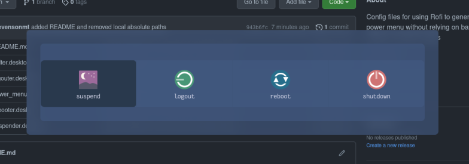

This is just a handful of desktop files and a rofi config that can be used to get a power menu without having to worry about custom modes, bash scripting, fancy icon fonts, and the like.

Copy the .desktop files to `~/.local/share/applications/` and run `update-desktop-database ~/.local/share/applications`.

You can put the rofi config file anywhere you like but I have it at `~/.config/rofi/power_menu.rasi`.

Call rofi using the command `rofi -drun-match-fields comment -show drun -filter "convenience" -config /path/to/power_menu.rasi`. You can set up an alias for this in your shell profile config or set up a keybinding for it to make life simpler.
